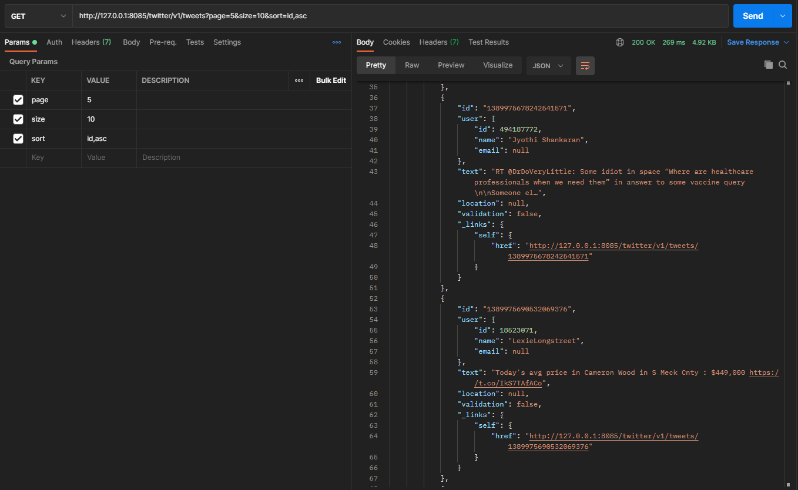
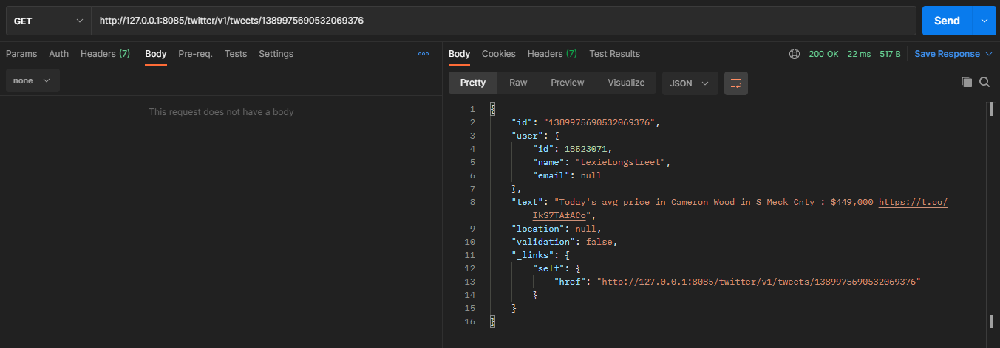
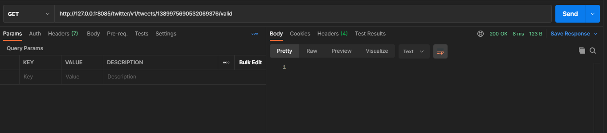
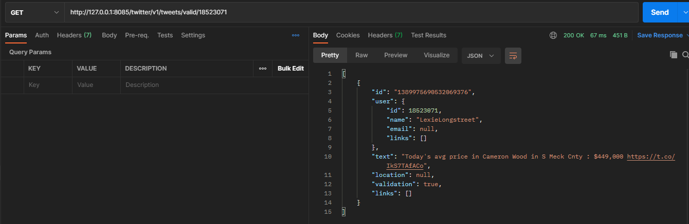
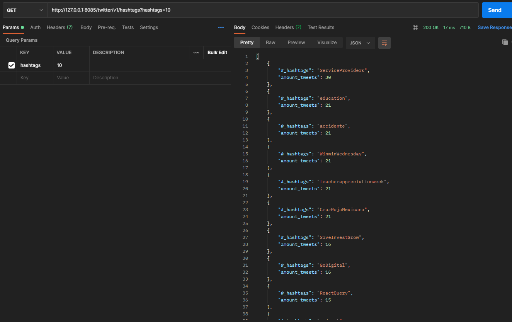
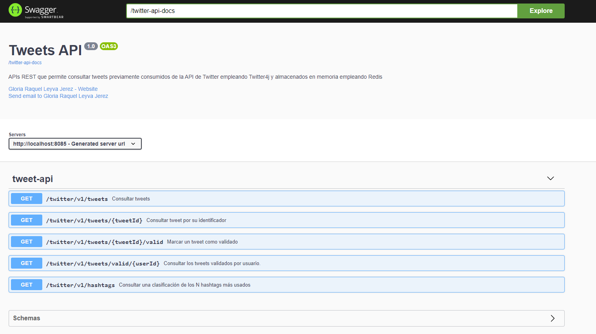
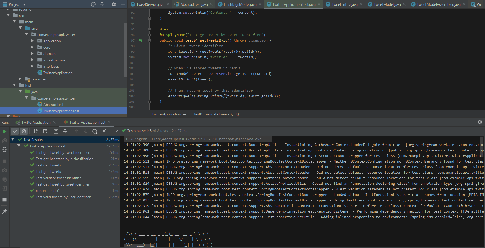

# TWEETS API REST
En este ejercicio desarrollo un servicio que consume tweets de la API de twitter usando `twitter4j` y basado en unos criterios de configuración los persisto en memoria usando `redis` para luego gestionarlos a través de una API REST. 
La API fue documentada con `Open API Swagger` y testeada con `Postman` y pruebas automatizadas con `JUnit`
Y los paquetes fueron estructurados siguiendo `Domain Driver Design` y se aplicaron patrones como Adapter, Fábricas, Repositorios entre otros. 
Para optimizar las consultas dado el volumen de datos manejados se emplea `HATEOAS` con `Paginación`, compresión `gzip` y se ha habilitado `HTTP2`.

Ruta de la documentación de swagger: `http://localhost:8085/my-twitter-api-docs`

### Instalación y despliegue
1. Descargar el proyecto e importarlo. Puede clonarlo desde: `https://github.com/grleyvaj/APIsREST_Tweet.git
2. `Intellij IDEA` como IDE de desarrollo. Descargar [aquí](https://www.jetbrains.com/es-es/idea/download/).
3. Instalar en el IDE el plugin `Lombok`. Para Intellij descargar [aquí](https://plugins.jetbrains.com/plugin/6317-lombok/). 
4. PostgreSQL. Configurar base de datos, puerto y host en `aplication.properties`
5. `Postman` para probar los endpoint de las APIs. Descargar [aquí](https://www.postman.com/downloads/).
6. `MAVEN` para gestionar las dependencias. Descargar [aquí](https://maven.apache.org/download.cgi/).
   El `pom/xml` contiene todas las dependencias que deben ser descargadas para el despliegue de este proyecto.
7. Instalar Servidor `Redis` y configurar puerto y host en `aplication.properties` 
   
    Para instalar en Windows: https://github.com/dmajkic/redis/downloads      
    
    Para instalar en Debian o Ubuntu: https://redislabs.com/ebook/appendix-a/a-1-installation-on-debian-or-ubuntu-linux/Descargar [aquí](https://www.jetbrains.com/es-es/idea/download/).
8. Especificar en `twitter4j.properties` las claves de acceso para la API de Twitter siguientes:
        
        oauth.consumerKey=#         
        oauth.consumerSecret=#        
        oauth.accessToken=#        
        oauth.accessTokenSecret=#
      
### Descripción del ejercicio práctico
1- El servicio que consume los tweets se llama `FilterTwitterStreamService` y se encuentra en la capa de `infraestructura` ya que es el servicio que se encarga de consumir la api externa de Twitter. 
Para poder realizar el consumo deben especificarse previamente las keys en el archivo de configuración `twitter4j.properties` (ver sesión de despliege)

2- La persistencia de los tweets se realiza en memoria usando `Redis`. Previamente debe instalarse el server de redis (ver sesión de despliege) y modificar puerto y host en el archivo de configuración `aplication.properties`. 

Para facilitar el trabajo con el manejo de datos y repositorios para la persistencia empleo JPA, por tanto se debe ir también al archivo de configuración `aplication.properties` y cambiar los parámetros de configuración de la base de datos, se encuentra apuntando para postgres (ver sesión de despliege).

Solamente se persisten los tweets cuyos usuarios superen un número N de seguidores (default 1500) y cuyo idioma esté en una lista de idiomas permitidos (default español, francés, italiano). 

Para configurar el N número de seguidores y los idiomas permitidos debe ir al archivo de configuración "application.properties" y actualizar el properties `query`. Seguido de `followers_count` especifique el N número de seguidores y seguido de `lang` y separado por comas especifique los idiomas permitidos.
  
En el siguiente enlace se encuenta la tabla de idiomas: Acceder [aquí](https://developer.twitter.com/en/docs/twitter-api/tweets/filtered-stream/integrate/build-a-rule).

3- A continuación se resumen los endpoints.
En el directorio `postman` se encuentra el archivo `Tweet API REST.postman_collection.json` con los request implementados para cada uno, el cual puede ser importado en dicha herramienta.

El servicio contiene los siguientes endpoints:
- Consultar los tweets: GET `/twitter/v1/tweets`. Se puede emplear paginación. 

Ejemplo: `http://127.0.0.1:8085/twitter/v1/tweets?page=20&size=20&sort=id,asc`
- Consultar un tweet por su identificador: GET `/twitter/v1/tweets/{tweetId}`

- Validar tweet: GET `/twitter/v1/tweets/{tweetId}/valid`

- Consultar los tweets validados por usuario (por el nombre de usuario): GET `/twitter/v1/tweets/valid/{userId}`

- Consultar una clasificación de los N hashtags más usados (default 10): GET `/twitter/v1/hashtags?hashtags=10`

Para un mejor entendimiento y además realizar pruebas, una vez que el proyecto se encuentra corriendo, se puede consultar la documentación de la API REST que he  desarrollado con OpenApi, enlace:
`http://localhost:8085/my-twitter-api-docs`

### Archivos y clases puntuales
- archivo `twitter4j.properties` contiene las claves de acceso a la API de Twitter
- archivo `application.properties` contiene las configuraciones del proyecto como DB, encoding, ruta para api-doc, etc.
- las clases `Documentation` almacenan la documentación, es para simplificar las clases controladoras, dejarlas con el mínimo de doc swagger.
- la clase `URIConstant` es donde he definido las URI del proyecto, para si en un futuro se desean cambiar, ir solo a este archivo en lugar de cada API.
- la clase `MyTweetApiRest` es la API REST del ejercicio.
- la clase `TweetService` es el servicio que desarrolla la lógica y comunicación con el servicio de Twitter y Persistencia.
- la clase `FilterTwitterStreamService` es el servicio que consume de la API de Twitter usando `twitter4j`.
- la clases `RepositoryImpl` son para gestionar el servicio de persistencia en memoria y usando JPA.

### Pruebas con JUnit
La implementación de las pruebas automatizadas se encuentran en la carpeta `test` del proyecto
